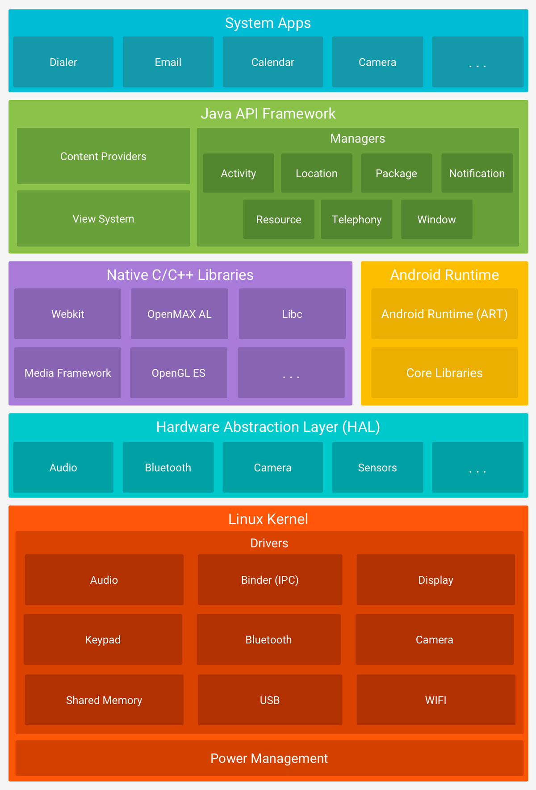
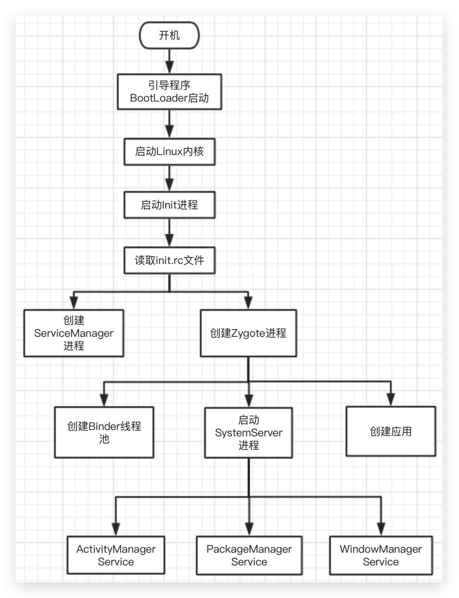

[TOC]
### Android系统架构图

### Android系统启动流程图

* init进程是Native世界的第一个进程

#### Zygote
* Zygote是init进程通过解析init.rc文件创建出的进程
* Zygote是Java世界的第一个进程
* SystemServer是Zygote创建的第一个进程
* 之后Zygote就用来fork出应用进程
* Zygote进程与其他进程间通过Socket进行通信

#### ServiceManager
> ServiceManager在init进程启动之后启动，用来管理系统中的service