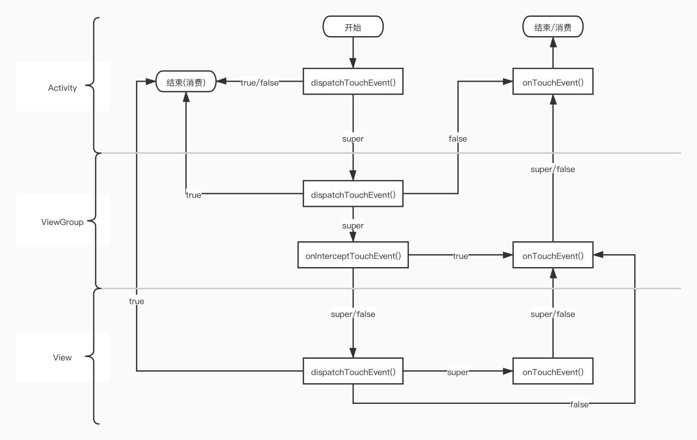

### 事件分发的主要方法
方法 | 作用 | 调用时机
--- | --- | ---
dispatchTouchEvent | 分发事件 | 当点击事件能够传递给当前View时
onInterceptTouchEvent | 判断是否拦截了某个事件(只存在ViewGroup中) | 在dispatchTouchEvent()内部调用
onTouchEvent | 处理点击事件 | 在dispatchTouchEvent()内部调用

* 事件分发顺序：`Activity`-->`ViewGroup`-->`View`

### 在Activity中
方法 | true | false | super
--- | --- | --- | ---
dispatchTouchEvent() | 消费事件 | **消费事件** | 事件下发到子View的dispatchTouchEvent() 

### 在ViewGroup中
方法 | true | false | super
--- | --- | --- | ---
dispatchTouchEvent() | 消费事件 | 不消费，不下发，交给父View的onTouchEvent() | 事件下发到当前ViewGroup的onInterceptTouchEvent()
onInterceptTouchEvent() | **事件下发到当前ViewGroup的onTouchEvent()** | **事件下发到子View的dispatchTouchEvent()** | 事件下发到子View的dispatchTouchEvent() 
onTouchEvent() | 消费事件 | 不消费，不下发，交给父View的onTouchEvent() | **不消费，不下发，交给父View的onTouchEvent()**

### 在View中
方法 | true | false | super
--- | --- | --- | ---
dispatchTouchEvent() | 消费事件 | 不消费，不下发，交给父View的onTouchEvent() | 事件下发到当前View的onTouchEvent() 
onTouchEvent() | 消费事件 | 不消费，不下发，交给父View的onTouchEvent() | **不消费，不下发，交给父View的onTouchEvent()**
