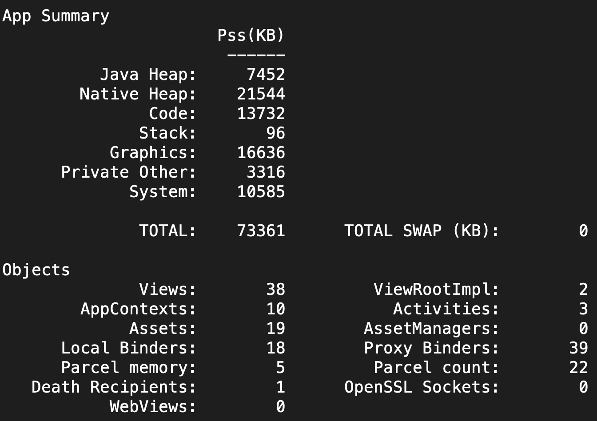

[TOC]

### DDMS
### LeakCanary
LeakCanary 的原理很简单: 在 Activity 或 Fragment 被销毁后, 将他们的引用包装成一个 WeakReference, 然后将这个 WeakReference 关联到一个 ReferenceQueue 。查看ReferenceQueue中是否含有 Activity 或 Fragment 的引用。如果没有 触发GC 后再次查看。还是没有的话就说明回收成功, 否则可能发生了泄露. 这时候开始 dump 内存的信息,并分析泄露的引用链。

```java
dependencies {
  debugImplementation 'com.squareup.leakcanary:leakcanary-android:2.3'
}
```
```xml
<provider android:name="com.android.tools.ir.server.InstantRunContentProvider" 
    android:multiprocess="true" 
 android:authorities="com.tzx.androidcode.com.android.tools.ir.server.InstantRunContentProvider"/>
```

### Shark
> Shark是为 LeakCanary 2 提供支持的堆分析器

* 安装：`brew install leakcanary-shark`
* 使用shark，被分析应用可以不依赖leakcanary-android：`shark-cli -d <设备> -p <包名> -m <混淆文件> analyze`

### Android Profiler
> Studio自带工具，提供堆转储、强制GC、跟踪内存分配等功能能

Column | Description
-- | --
Java | Dalvik Heap。从 Java 或 Kotlin 代码分配的对象内存
Native | Native Heap。从 C 或 C++ 代码分配的对象内存。即使应用中不使用 C++，也可能会看到此处使用的一些原生内存，因为 Android 框架使用原生内存代表您处理各种任务，如处理图像资源和其他图形时，即使只采用 Java 或 Kotlin 语言
Graphics | Gfxdev + EGL mtrack + GL mtrack。图形缓冲区队列向屏幕显示像素（包括 GL 表面、GL 纹理等等）所使用的内存（这是与 CPU 共享的内存，不是 GPU 专用内存）
Stack | Stack。应用中的原生堆栈和 Java 堆栈使用的内存。 这通常与应用运行多少线程有关
Code | all mmaps。应用用于处理代码和资源（如 dex 字节码、已优化或已编译的 dex 码、.so 库和字体）的内存
Other | Other dev + Unknown。应用使用的系统不确定如何分类的内存
Allocated | 应用分配的 Java/Kotlin 对象数，没有计入 C 或 C++ 中分配的对象

Column | Description
--- | ---
Allocations | 实例个数 
Native Size | 所有该实例在Native层占用大小（以字节为单位） 
Shallow Size | 所有该实例在堆内存中占用大小（以字节为单位） 
Retained Size | 所有该实例在堆内存中占用大小，及成员变量对象实例的大小，以此遍历的全部大小。代表该对象回收时可释放内存大小 
Depth | 从 GC Root 到该对象的引用链路的最短步数

### MAT(Memory Analyzer)
* Studio Profiler，heap dump
* 在`sdk/platform-tools/`执行`hprof-conv source.hprof dest.hprof`
* 选择`Histogram`视图，按照package排序，找到泄漏的对象，右键选择`List objects`，`with incoming references`(该对象被谁引用，相应outcoming该对象引用了谁)
* 找到被引用后，右键`Path To GC Roots`，`exclude all phantom/weak/soft etc. references`


视图 | 含义
:--: | ---
Histogram | 列举内存中对象存在的个数和大小，以及对于的名称
Dominator Tree | 站在对象的角度查看他们的内存情况
Top Consumers | 该视图会显示可能的内存泄漏点
Duplicate Classes | 检测由多个类加载器加载的类

### dumpsys meminfo
> Android 系统是基于 Linux 内核的操作系统，所以在 Linux 中查看内存使用情况的命令在 Android 手机上也能使用比如 top 命令。

* adb shell dumpsys meminfo <包名>|<pid>


### Jhat
### APT
### LeakInspector
### Chrome Devtool
### GC Log