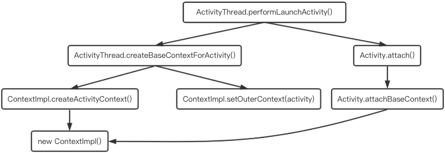

[TOC]

### LayoutInflater的创建
> LayoutInflater是一个抽象类，它的创建，并不是交由App层处理的，而是调用了from()的静态函数，经由系统服务LAYOUT_INFLATER_SERVICE，最终创建了一个LayoutInflater的子类对象--PhoneLayoutInflater


* `baseContext`就是`ContextWrapper`里的`mBase`属性，`ContextImpl`实例对象，创建过程如下：


### inflate()的使用
root | attachToRoot | return | 说明
:---: | :---: | :---: | ---
parentLayout | true | parentLayout | 布局已被绑到parent上，无需额外addView()，否则会报错
parentLayout | false | inflateRoot | 布局未绑定到parent上，需额外addView()，此时添加parent是为了解析被填充布局根元素的参数，使其在addView()时生效
null | false |inflateRoot | 不正确写法，导致被填充布局的根元素的参数无法解析
null | true |inflateRoot | 此时true无效，等同于false

### LayoutInflater耗时点
> LayoutInflater将xml文件实例化为一个view对象的流程，其中有两个部分是耗时的主要来源

* XmlResourseParser对xml的遍历
* 反射创建View对象导致的耗时(反射比直接创建对象要慢3倍，iReader的x2c框架就是基于这一点去做的优化)

### inflate流程
#### inflate(resource, root, attachToRoot)
```java
View inflate(int resource, ViewGroup root, boolean attachToRoot) {
    final Resources res = getContext().getResources();
    final XmlResourceParser parser = res.getLayout(resource);
    try {
        return inflate(parser, root, attachToRoot);
    } finally {
        parser.close();
    }
}
```
#### inflate(parser, root, attachToRoot)
```java
View inflate(XmlPullParser parser, ViewGroup root, boolean attachToRoot){
    final AttributeSet attrs = Xml.asAttributeSet(parser);
    // 需要返回的view对象
    View result = root;

    final String name = parser.getName();

    if (TAG_MERGE.equals(name)) {// 如果使用merge标签
        if (root == null || !attachToRoot) {// 使用merge标签必须传入root，且add到root上，否则就会抛出异常
            throw new InflateException("<merge /> can be used only with a valid ViewGroup root and attachToRoot=true");
        }
        // 递归向下遍历xml布局
        rInflate(parser, root, mContext, attrs, false);
    } else {// 如果不使用merge标签，创建tmp作为临时的根节点，并最终赋值给result返回
        // Temp is the root view that was found in the xml
        // 反射创建View对象
        final View temp = createViewFromTag(root, name, mContext, attrs);

        ViewGroup.LayoutParams params = null;

        if (root != null) {
            // Create layout params that match root, if supplied
            // 根据rootView生成layoutparams
            params = root.generateLayoutParams(attrs);
            if (!attachToRoot) {
                // Set the layout params for temp if we are not
                // attaching. (If we are, we use addView, below)
                temp.setLayoutParams(params);
            }
        }

        // Inflate all children under temp against its context.
        // 递归向下遍历xml布局
        rInflateChildren(parser, temp, attrs, true);

        // We are supposed to attach all the views we found (int temp)
        // to root. Do that now.
        if (root != null && attachToRoot) {// 将布局add到root上
            root.addView(temp, params);
        }

        // Decide whether to return the root that was passed in or the
        // top view found in xml.
        if (root == null || !attachToRoot) {
            result = temp;
        }
    }
    return result;
}
```
#### rInflate(parser, parent, context, attrs, finishInflate)
```java
void rInflate(XmlPullParser parser, View parent, Context context, AttributeSet attrs, boolean finishInflate) {
    final int depth = parser.getDepth();
    int type;
    boolean pendingRequestFocus = false;

    while (((type = parser.next()) != XmlPullParser.END_TAG || parser.getDepth() > depth) && type != XmlPullParser.END_DOCUMENT) {
        if (type != XmlPullParser.START_TAG) {
            continue;
        }

        final String name = parser.getName();

        if (TAG_REQUEST_FOCUS.equals(name)) {// 如果需REQUEST_FOCUS标签
            pendingRequestFocus = true;
            consumeChildElements(parser);
        } else if (TAG_TAG.equals(name)) {// 如果是“tag”标签
            parseViewTag(parser, parent, attrs);
        } else if (TAG_INCLUDE.equals(name)) {// 如果是Include标签
            if (parser.getDepth() == 0) {
                throw new InflateException("<include /> cannot be the root element");
            }
            // 对include标签进行解析
            parseInclude(parser, context, parent, attrs);
        } else if (TAG_MERGE.equals(name)) {// 如果是merge标签
            throw new InflateException("<merge /> must be the root element");
        } else {// 其他标签
            // 反射创建View
            final View view = createViewFromTag(parent, name, context, attrs);
            final ViewGroup viewGroup = (ViewGroup) parent;
            final ViewGroup.LayoutParams params = viewGroup.generateLayoutParams(attrs);
            // 递归调用rInflate函数
            rInflateChildren(parser, view, attrs, true);
            viewGroup.addView(view, params);
        }
    }

    if (pendingRequestFocus) {
        parent.restoreDefaultFocus();
    }
}
```
#### createViewFromTag(parent, name, context, attrs)
```java
View createViewFromTag(View parent, String name, Context context, AttributeSet attrs) {
    if (name.equals("view")) {
        name = attrs.getAttributeValue(null, "class");
    }

    // Apply a theme wrapper, if allowed and one is specified.
    if (!ignoreThemeAttr) {
        final TypedArray ta = context.obtainStyledAttributes(attrs, ATTRS_THEME);
        final int themeResId = ta.getResourceId(0, 0);
        if (themeResId != 0) {
            context = new ContextThemeWrapper(context, themeResId);
        }
        ta.recycle();
    }

    // 尝试使用Factory创建View对象
    View view = tryCreateView(parent, name, context, attrs);

    if (view == null) { // 如果tryCreateView返回null
        if (-1 == name.indexOf('.')) {  //如果当前Tag含有“.”
            view = onCreateView(context, parent, name, attrs);
        } else {
            view = createView(context, name, null, attrs);
        }
    }

    return view;
}
```
#### createView(name, prefix, attrs)
```java
View createView(String name, String prefix, AttributeSet attrs) {
    Constructor<? extends View> constructor = sConstructorMap.get(name);
    if (constructor != null && !verifyClassLoader(constructor)) {
        constructor = null;
        sConstructorMap.remove(name);
    }
    Class<? extends View> clazz;

    if (constructor == null) {// map里没有保存控件的构造器
        // Class not found in the cache, see if it's real, and try to add it
        clazz = mContext.getClassLoader().loadClass(prefix != null ? (prefix + name) : name).asSubclass(View.class);

        if (mFilter != null && clazz != null) {
            boolean allowed = mFilter.onLoadClass(clazz);
            if (!allowed) {
                failNotAllowed(name, prefix, attrs);
            }
        }
        constructor = clazz.getConstructor(mConstructorSignature);
        constructor.setAccessible(true);
        sConstructorMap.put(name, constructor);
    } else {// If we have a filter, apply it to cached constructor
        if (mFilter != null) {
            // Have we seen this name before?
            Boolean allowedState = mFilterMap.get(name);
            if (allowedState == null) {
                // New class -- remember whether it is allowed
                clazz = mContext.getClassLoader().loadClass(prefix != null ? (prefix + name) : name).asSubclass(View.class);

                boolean allowed = clazz != null && mFilter.onLoadClass(clazz);
                mFilterMap.put(name, allowed);
                if (!allowed) {
                    failNotAllowed(name, prefix, attrs);
                }
            } else if (allowedState.equals(Boolean.FALSE)) {
                failNotAllowed(name, prefix, attrs);
            }
        }
    }

    // 实例化出控件
    final View view = constructor.newInstance(args);
    if (view instanceof ViewStub) {// Use the same context when inflating ViewStub later.
        final ViewStub viewStub = (ViewStub) view;
        viewStub.setLayoutInflater(cloneInContext((Context) args[0]));
    }
    return view;
}
```


1. LayoutInflater.inflate()
2. Resources.getLayout()(`I/O操作`)
3. inflate()中调用LayoutInflater.createViewFromTag()
4. LayoutInflater.Factory.onCreateView()
5. 如果没有Factory，则LayoutInflater.createView()(`反射创建View`)

### BlinkLayout
> 一个隔0.5秒闪烁一次的布局
```xml
<blink
    android:layout_width="wrap_content"
    android:layout_height="wrap_content"
    android:layout_centerHorizontal="true"
    app:layout_constraintBottom_toBottomOf="parent"
    app:layout_constraintLeft_toLeftOf="parent"
    app:layout_constraintRight_toRightOf="parent"
    app:layout_constraintTop_toTopOf="parent">

    <TextView
        android:layout_width="wrap_content"
        android:layout_height="wrap_content"
        android:text="Android研习社"
        android:textColor="#157686"
        android:textSize="55sp" />
</blink>
```

