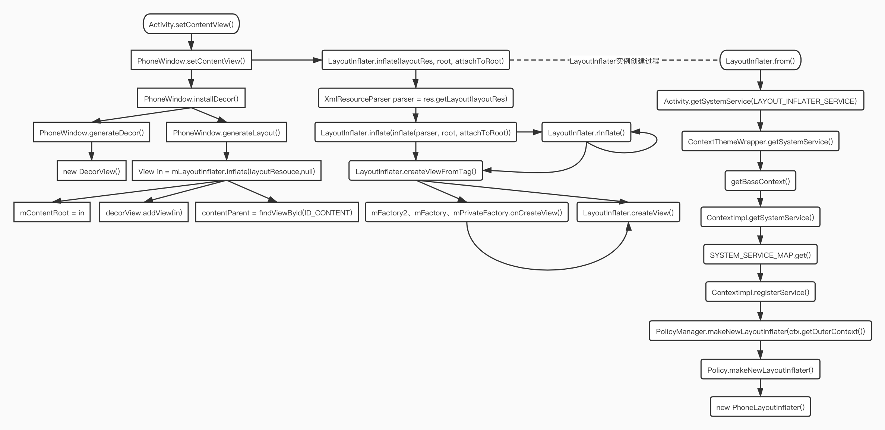

[TOC]



### PhoneWindow
* 在`Activity.attach()`里创建实例
* `mContentParent`：id为content的FrameLayout
* `mContentRoot`：`DecorView`的子View

### Activity
* `attach()`：在ActivityThread.performLaunchActivity()中被调用，初始化mWindow

### PolicyManager
* `makeNewWindow()`：调用`Policy.makeNewWindow()`
* `makeNewLayoutInflater()`：调用`Policy.makeNewLayoutInflater()`

### Policy
`makeNewWindow()`：`new PhoneWindow(context)`，5.1中window的唯一初始化方式

* `makeNewLayoutInflater()`：`new PhoneLayoutInflater(context)`，5.1中layoutInflater唯二初始化地方

### WindowManagerImpl&WindowManagerGlobal
`WindowManagerImpl`为`WindowManager`的实现类，而`WindowManager`又是`ViewManager`的实现接口。`WindowManagerImpl`内部方法实现都是由代理类`WindowManagerGlobal`完成，而`WindowManagerGlobal`是一个单例，也就是一个进程中只有一个`WindowManagerGlobal`对象服务于所有页面的View。

```java
public final class WindowManagerGlobal {
    // 所有Window对象中的View
    private final ArrayList<View> mViews = new ArrayList<View>();
    // 所有Window对象中的View所对应的ViewRootImpl
    private final ArrayList<ViewRootImpl> mRoots = new ArrayList<ViewRootImpl>();
    // 所有Window对象中的View所对应的布局参数
    private final ArrayList<WindowManager.LayoutParams> mParams = new ArrayList<WindowManager.LayoutParams>();
}
```

### ViewRootImpl
> ViewRoot是GUI管理系统与GUI呈现系统之间的桥梁。


`ViewRootImpl`是`View`中的最高层级，属于所有`View`的根（但`ViewRootImpl`不是`View`，只是实现了`ViewParent`接口），实现了`View`和`WindowManager`之间的通信协议，实现的具体细节在`WindowManagerGlobal`这个类当中。通过`ViewRootImpl`来更新界面并完成`Window`的添加过程。

##### ViewRootImpl的初始化
在`Activity`回调`onResume()`时，会调用`ActivityThread.handleResumeActivity()`，通过activity实例获取`WindowManager`实例，将`PhoneWindow`中的`DecorView`通过`WindowManager.addView()`添加到activity，内部实际是调用了`WindowManagerGlobal`的`addView()`，在`addView()`中创建`ViewRootImpl`实例，并将`ViewRootImpl`、`View`、`LayoutParams`实例存入集合。

* 里面有`ViewRootHandler`、`SyntheticJoystickHandler`、`SyntheticTouchNavigationHandler`这3个Handler
* performTraversals：在此方法中完成对View的MLD
* 

### DecorView
> 界面的根View，PhoneWindow的内部类。