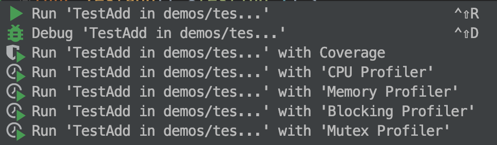

[TOC]

## 基础
### go语言特性
* 严格语法
	* 不使用的变量、引用会报错
	* 花括号不能换行
* 优化语法
	* 先写变量名再写变量类型
	* 省写分号、表达式括号
	* `import`、`var`、`const`等多个的时候可以用括号括起来
* 函数式编程语言
* 没有过分花哨的写法，平衡可读性与编程效率
* 不支持继承、指针运算、引用传递等影响灵活性或容易出错的

### 基础类型(8种)
类型 | 长度 | 范围
--- | --- | ---
int | 默认64位，后缀8、16、32、64 | 默认正负各半，前缀u表示正整数
byte | 8位 | 0-255
float | 32、64位 | 
complex | 64、128位 | 复数类型，实部、虚部各占一半
bool | 8位 | true、false
指针 | 64位 | 
rune | 32位 | rune其实是int32的别名 
string | 128位 | 

### 常量
* `const`
* 常量可以不指定类型

### if
* if条件没有括号
* if条件里可以赋值，赋值变量的作用域只在这个if的语句中

```go
const fileName = "a.txt"
if bytes, err := ioutil.ReadFile(fileName); err != nil {
	fmt.Println("error-->", err)
} else {
	fmt.Printf("%s", bytes)
}
```

### switch
* case结尾不用加break，会自动break，不break的要显示的加`fallthrouth`
* 可以不传switch值，只写case，当做if/else用
* `typeswitch`

### for
* for条件不需要括号
* for条件可以省略初始条件、结束条件、递增表达式，连分号都省了
* go语言没有while，有for就够了

### 指针
```go
var a int = 2
var pa *int = &a
*pa = 3
fmt.Println(a)
```
* `*int`：指针的类型为`*int`
* `&a`：取变量`a`在内存中的地址
* `*pa`：内存地址指向的变量，相当于变量a
* go语言的指针不能运算
* go语言只有`值传递`一种(大部分语言除了基本类型是`值传递`外，其他全是`引用传递`)
* 变量的地址是不变的，值是可变的(包括指针变量，指针类型变量的值是地址)
* go语言中`var user User`所发生的事：
  * 为`user`变量分配内存空间，所以`&user`(user的地址)永远不会变
  * 为`user`变量初始化，内部字段都是“零值”
  * 在java中，此时没有分配内存空间，也没有初始化，new出对象时才分配内存空间，赋值给声明变量后，相当于变量指向这个对象
  * java的方式，对应于go应该是`var user *User`，此时user是nil
  * 所以说，在`var user User`后，可以直接`user.name="gxd"`，不用`user=User{"gxd"}`

### 数组
* `[2]int`、`[3]int`是两种类型
* `range`关键字可以方便遍历数组
```go
var arr1 [2]int
arr1 = [2]int{1, 2}

var arr2 = [3]int{1, 2, 3}

var arr3 = [...]int{4, 5, 6}

var arr4 [4][5]int

for i, v := range arr3 {
	fmt.Println(i, v)
}
```

### Slice(切片)
* 中括号里不加数字表示切片类型，如`[]int`
* `slice`本身没有数据，是对底层array的一个view(视图)，相当于数组的地址`&array`
* `Slice`是由`ptr`、`len`、`cap(capacity)`组成
* `Slice`的`capacity`是从起始位置对应的数组位置到数组结束的位置
* `Slice`可以向后扩展，但不能超过`cap(s)`，也就是对应数组的末尾
* s[i]不能超过len(s)
* `Slice`不能向前扩展

```
var arr = [5]int{0, 1, 2, 3, 4}
var slice1 = arr[0:2]
var slice2 = arr[:2]
var slice3 = arr[2:]
var slice4 = arr[:]// 数组转切片
```
* `append()`：为slice末尾添加元素，此时view的不再是之前的array，系统会new一个新的数组，之前的数组如果没有被引用也会被回收掉 
* 创建切片
```go
slice1 := []int{1, 2, 3, 4}
slice2 := make([]int, 4, 6)
```
* copy切片：`copy()`
* 删除切片：
```go
slice1 := []int{1, 2, 3, 4}
slice1 = append(slice1[:1], slice1[2:]...)
```
### Map
* 除了slice、map、function的内件类型都可以作为key
* map使用hash表，key必须可以比较相等
```go
// 创建map
map1 := map[string]int{
	"a": 1,
	"b": 2,
	"c": 3,
	"d": 4,
	"e": 5,
}
map2 := make(map[rune]int)

var map3 map[string]string

fmt.Println(len(map1), map2, map3)

// 遍历map，不保证遍历顺序
for k, v := range map1 {
	fmt.Println(k, v)
}

// 根据key取value
value, ok := map1["c"]
fmt.Println(value, ok)

// 删除元素
delete(map1, "d")
fmt.Println(map1)
```

## 进阶
### 函数
* 函数形式：`关键字 函数名(参数) 返回值`，例如`func xxx(a int) int {`
* 可以有多个返回值
* 返回类型加上变量名，使用时方便自动生成变量名
```go
func multiReturn() (a int, b int, c string) {
	a = 1
	b = 2
	c = "abc"
	return a, b, c
}
```
* 多个返回值如果有不用的，用`_`来接收这个值
* 函数可以作为参数传递
* 闭包：函数体内可以连接到外部变量，类似内部类持有外部的引用
* 函数也能实现接口...
* 函数是变量
* 匿名函数
```go
func() {
	fmt.Println("aaa")
}()
```

### 面向对象
* go语言不支持继承、多态，只有封装
* go语言没有构造函数
* go语言不需要关心变量在堆还是栈中
```go
var root treeNode
root = treeNode{value: 3}
root.left = &treeNode{}
root.right = &treeNode{5, nil, nil}
root.right.left = new(treeNode)
```
* 结构体定义方法：在`func`和函数名之间加`接收者`，其实和形参一样，只是调用时变成了：node.print()
```go
// node相当于this
func (node treeNode) print() {
	fmt.Println(node.value)
}
```
* nil指针也可以调用方法(内建类型、结构体都有默认初始化，指针默认为nil)
* go语言通过组合、定义别名，两种方式替代继承

### 接口
* go语言的接口更加灵活、强大，能够代替其他语言的继承功能
* `duck typing`：接口由使用者定义，而不是实现者(大黄鸭是不是鸭子又不同的人决定，小朋友认为是鸭子，生物学家认为不是鸭子)
* go语言属于结构化类型系统，类似`duck typing`
* go语言接口实现是隐式实现，不需要写类似java中的`implement Runnable`
* go语言的接口是由调用者定义的
* 接口由使用者定义，实现者只管实现功能，使用者根据自身需求定义接口，这种多态更加灵活
* 接口的实现类型可以是类，也可以是指针
* 接口对象中包含：`实现类型`、`接口实现实例地址`
* 接口变量同样是值传递，但由于内部包含指针，所以几乎不需要定义接口指针
* 查看接口类型(类似强转)：`Type Assertion`、`Type Switch`
* `interface{}`：表示任何类型
* `变量.(类型)`：表示强转，例如`a.(int)`
* 接口可以组合
```go
type GetAndPost interface {
	Retriever
	Poster
	OtherMethod(url string) string
}
```

### Goroutine
* 协程是轻量级的线程：
	* 协同式线程调度，而非抢占式线程调度，由协程主动交出控制权
	* 编译器/解释器/虚拟机层面的多任务
	* go语言有自己的调度器
	* 多个协程可以在一个或多个线程上运行
	* 函数前面只需加上go就能给调度器运行
* goroutine可能的切换点：
	* I/O,select
	* channel
	* 等待锁
	* 函数调用(有时)
	* runtime.GoSched()

### Channel
* `chan<- int`：发送数据类型，不能接收数据
* `chan-> int`：接收数据类型，不能发送数据
* `close(c)`：发送方关闭channel
* `make(chan int, 3)`：缓存3个channel
* 判断是否发完：
	* `for v := range c {`
	* `n, ok := <-c`：ok为true
* Channel基于CSP模型(Communication Sequential Process)
* Don't communicate by sharing memory;sharing memory by communicating.
* channel的发送时阻塞式的(block)，直到有人接收
* channel作为参数一般不用写成指针，内部包含指针

## 其他
### 包和封装
* 每个目录只能有一个包
* 包名和目录不一定一样
* 结构体、函数等首字母大写代表public，小写代表private(不能跨包访问)
* 为结构体定义的方法必须在同一个包内，可以是不同文件 

### GOPATH环境变量
* 默认在`~/go`
* 官方推荐所有项目、第三方库都放在同一个GOPATH下，也可以放在不同的GOPATH下
* 确认环境变量是否存在命令：`echo $GOPATH`
* 查看环境变量配置文件：`cat ./bash_profile`
* 配置环境变量
```
GOPATH=/Users/guoxiaodong/go
PATH=$PATH:$GOPATH/bin
```
* 使环境变量生效：`source ~/.bash_profile`
* 注意：配置好后会到GOPATH下的`src`里面找，项目的根目录要是`src`

### Go命令
* 安装gopm：
	* `go get -v -u github.com/gpmgo/gopm`
* 安装go import：
	* `gopm get -g -v -u golang.org/x/tools/cmd/goimports`
* `go install golang.org/x/tools/cmd/goimports`：先build，再放入GOPATH下的bin文件夹
* 运行当前目录下的测试：`go test demos/test/ `
* 查看文档：`go doc fmt.Println`
* `godoc -http :6060`
* 加一个`top`命令
* `go run -race goroutine/goroutine.go`

### 资源管理&错误处理
* `defer`：Java中的`finally`，后进先出，栈结构
* `panic`：停止当前函数执行，一直向上返回，执行每一层的defer，如果没有遇见`recover`，程序退出
* `recover`：仅在`defer`调用中使用，获取`panic`的值，如果无法处理可重新`panic`

### 表格驱动测试、性能测试、文档
* 传统测试的缺点：
	* 测试数据和测试逻辑混在一起
	* 出错信息不明确
	* 一单一个数据出错，测试全部结束
* 表格驱动测试文件与被测文件放在一起：`测试功能_test.go`
* 测试方法：`func TestAdd(t *testing.T) {`
* 测试覆盖率、性能测试：

	* `go test demos/test/ -coverprofile=c.out`
	* 查看文件：`less c.out`
	* ``go tool cover -html=c.out`目录下要有`c.out`
	* `go test demos/repeat/ -bench .`目录下要有`testing.B`
	* `go test -bench . -cpuprofile=cpu.out`
	* `go tool pprof cpu.out`、`web`、`quit`
* `example示例`是一种特殊的测试
```go
func ExampleQueue_PoP() {
	q := Queue{1}
	q.Push(2)
	q.Push(3)
	fmt.Println(q.PoP())
	fmt.Println(q.PoP())
	fmt.Println(q.IsEmpty())
	fmt.Println(q.PoP())
	fmt.Println(q.IsEmpty())

	// Output:
	// 1
	// 2
	// false
	// 3
	// true
}
```

### 格式占位符
占位符 | 说明 | 输出
--- | --- | ---
%T | type(类型) | main.Tree
%v | value(值) | {}
%p | pointer(地址) | 0xffe00011ee
%s | string(字符串) | abc
%q | quote(带引号的字符串) | "abc"
%c | char(unicode字符) | 呀
%d | 十进制 | 18
%t | 布尔 | true
%b | 二进制 | 101
%o | 八进制 | 12
%X | 大写十六进制 | 1FD

### GoLand破解
* `Help`下，选择`Edit Custom VM Options`，末尾添加`-javaagent:/Users/guoxiaodng/jetbrains-agent.jar`
* 重启GoLand(如果无法重启则删除`~/Library/Preferences/GoLand2019.1`目录)，`Help`下`Register`，选择`License Server`，点击`Discover Server`或输入`http://jetbrains-license-server`，最后点击`Active`
* 右下角显示`You Copy is Licensed to guoxiaodong`，表示激活成功！