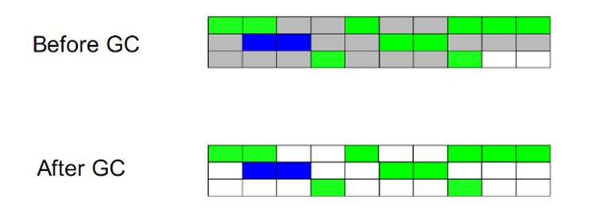
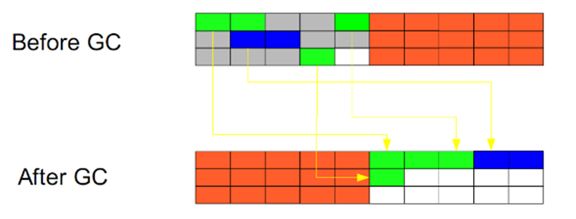
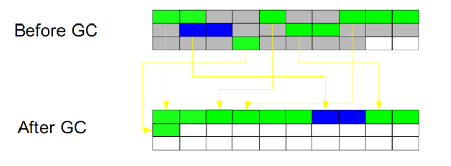

[TOC]

### 判断对象是否存活
#### 引用计数法
> 通过记录引用次数，判断是否回收，但无法解决相互循环引用的问题，所以主流Java虚拟机并未采用

#### 可达性分析算法
> 采用有向图的方式，判断GC Roots能否到达这个对象

#### GC Root节点
* 虚拟机中局部变量引用的对象
* 类静态属性引用的对象
* 常量引用的对象
* JNI中引用的对象

### 垃圾回收算法
#### 标记-清除算法(Mark-Sweep)
> 标记需要回收的对象，再统一回收。但产生了大量不连续的内存碎片，分配需要较大内存的对象时无法使用这些碎片。

#### 复制算法(Copying)
> 将内存分为相等的两块，只是用其中的一块。当一块用完时，将不可回收仍在使用的内存复制到另一块。

#### 标记-整理算法(Mark-Compact)
> 标记部分与之前一样，整理时将存活对象向一端移动，使所有存活对象在一起

#### 分代收集(Generational Collection)
* 一般是把Java堆分为新生代和老年代
* 新生代大多数对象是可回收的，采用复制算法，只需复制少量不可回收仍在使用的对象即可
* 老年代大多数不可回收，可采用标记整理或标记清除
* 对象如果在新生代几次GC仍存活，则放入老年代
* 