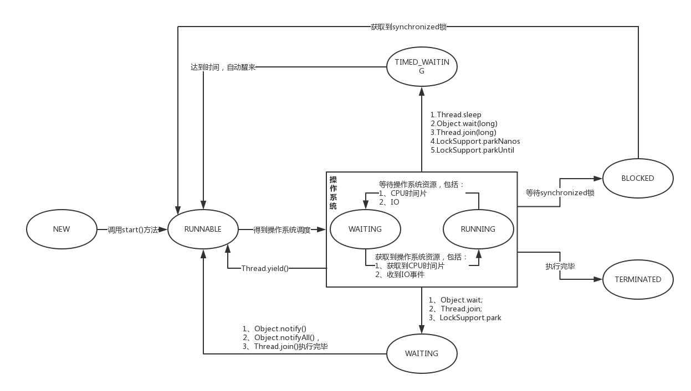
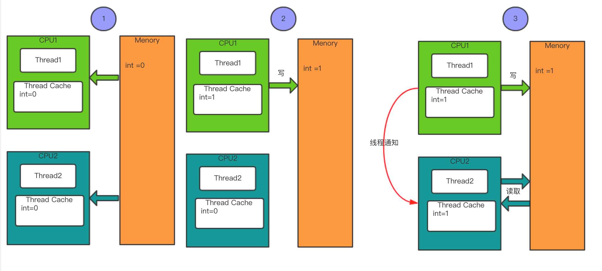

[TOC]
### CPU
> 我们都知道CPU是计算机的中央处理器，CPU的主要功能是运算。对CPU的关注通常都是CPU的核心数和CPU的线程数。而CPU的核心数代表硬件上存在着几个核心。而这些核心是相对独立的CPU核心单元组。在没有超线程技术的时候，一个核心只能处理一个线程，而有了超线程技术后，一个核心可以处理两个线程。例如双核心四线程。就是有两个CPU核心而每个核心可以处理的线程数就是两个。

### 进程
> 进程即为程序运行的资源分配和调用的基本单位，而进程里面是存在多个线程。进程中的每个线程都会共享进程中的资源。例如启动我们的JAVA应用就是启动一个进程，每个请求我们都使用一个线程处理，而每个请求中使用到的全局变量这些就是共享的资源。

### 线程
> 线程是CPU执行的基本单位。线程可以把进程的资源分配和执行调度分开，各个线程既可以共享进程资源，又可以独立调度。而在同一时间片刻下CPU只能执行1个线程。多线程执行CPU通过分配给每个线程的执行时间段以达到多线程计算。这种切换会导致上下文切换。而频繁的上下文切换会影响性能。

### CPU时间片
> CPU时间片即CPU分配给每个线程的执行时间段，称作它的时间片。CPU时间片一般为几十毫秒(ms)。

### 上下文切换
> CPU通过时间片段的算法来循环执行线程任务，而循环执行即每个线程允许运行的时间后的切换，而这种循环的切换使各个程序从表面上看是同时进行的。而切换时会保存之前的线程任务状态，当切换到该线程任务的时候，会重新加载该线程的任务状态。而这个从保存到加载的过程称之为上下文切换。

### 线程调度
> 线程调度就是系统为线程分配执行时间的过程。

### 线程调度的方式
* **协同式线程调度**：线程之间的系统执行时间，由线程本身进行进行控制。这种线程调度方式就像接力赛，一个执行完毕后交由下一个接力。如当前线程执行完毕后，通知系统调度到其他线程执行。
	* 协同的好处：线程的切换是可预知的。线程之间不存在同步的问题。
	* 协同的坏处：协同调度的致命缺点是当某个线程执行有问题的时候，会导致整个运行阻塞和系统崩溃。
* **抢占式线程调度**：线程之间的系统执行时间，是由系统进行控制。而抢占式的线程调度对线程的不可预知，系统定期的中断当前正在执行的线程，将CPU执行权切换到下一个等待的线程。所以任何一个线程都不能独占CPU。正因为这种定期的线程切换导致线程之间存在不同的问题。当线程执行过程中，某个线程出现问题的时候，由线程对CPU不具有独占性。因此不会造成阻塞。

* Java线程调度就是抢占式调度。

### 线程状态



* NEW
> 新创建一个线程是处于该状态。

* RUNNABLE
> 线程的调度是由操作系统可以决定，因此Runnable是包含Ready和Running。当我们调用了start()方法后，当前的线程处于一个Ready的状态，等待操作系统线程调用到当前线程分配CPU执行时间，若当前线程获得CPU执行时间时，线程就处于一个Running的状态。而在Running状态的情况下，我们可以调用yield()方法，放弃当前线程的CPU执行。而调用yield后当前线程处于一个Ready的状态，这种状态下操作系统在线程调度的时候分配CPU执行时间给当前的线程。

* BLOCKED
> 阻塞状态下代表着当前的线程被挂起。而这挂起的原因的线程在等待一个锁。如我们在一个方法或者代码块中使用Synchronized时，同一时间有2个线程进入该方法的时候，先获取到锁的线程执行。而没有获得锁的线程就处于这种阻塞状态。

* WAITING
> 等待状态下，当前线程不被执行和操作系统不会给该线程进行线程调度。而当前线程处于等待其他线程唤醒。只有被唤醒后，操作系统才会给该线程进行线程调度。这种线程的等待的主要作用是为了线程之间的协作。一般情况下通过Synchronized获得锁后，调用锁的wait的方法进入等待状态，而调用wait方法后，当前的线程会释放锁，而另外一个线程获得锁后，通过notifyall()/notify()进行唤醒处于等待的线程。

* TIMED_WAITING(计时等待)
> 处于这种有限期的等待的情况下，在限期内当前线程不会被执行和操作系统不会给该线程进行线程调度。在限期过后，操作系统才给该线程进行线程调度。

* TERMINATED
> 该状态下线程处于终止，而这种终止引起的原因分为正常的执行完毕的终止和非正常情况下的终止，而非正常情况下可能是线程执行异常或者调用interrupt()中止线程引起。

### 多线程编程的好处
* 充分利用CPU的资源。
* 加快请求响应
* 异步化

### 多线程带来的问题
* 设计更复杂
  * 线程之间是共享进程资源，存在资源冲突。
  * 线程之间的协作往往是非常复杂。若不能正确的使用锁的机制，通常会造成数据错误，整个业务功能出现问题。
* 上下文切换的开销
* 增加资源消耗，多线程变成是一种空间换时间的方式。线程在运行的时候需要从计算机里面得到一些资源。除了CPU，线程还需要一些内存来维持它本地的堆栈，若开启过多的线程时会导致程序占用过多的内存和机器崩溃。

### interrupt
> AVA提倡通过协作的方式结束线程，而不是使用强制停止的方式进行结束线程如stop()、resume()、suspend()已不建议使用，stop()会导致线程不会正确释放资源，suspend()容易导致死锁。那么怎样协同的方式结束线程呢？就是同过Thread的interrupt()方法进行协作中断线程。而调用interrupt方法是在线程中设置一个中断的标志位，中断标志默认为fals。被中断的线程通过循环的方式监听这个标志位确定当前线程需要中断。

方法名 | 方法类型 | Demo | 描述
--- | --- | --- | ---
isInterrupted | 对象方法 | Thread.currentThread().isInterrupted() | 判断当前线程是否处于中断状态
interrupt | 对象方法 | Thread.currentThread().interrupt() | 设置标志位为true
interrupted | 静态方法 | Thread.interrupted() | 判断当前线程是否处于中断状态并且设置中断状态为false

* 在进行协作处理线程结束的时候清除标志位。在我们的被中断的线程中如果使用到了sleep方法时，如果中断线程调用时，该线程处于sleep时，会抛出InterruptedException，如果使用进行try/catch捕捉该异常的时候会清除标志位。所以我们需要再调用被中断的线程的    interrupt()方法。

### yield
> yield的主要作用的是让出CPU的执行时间，需要注意的时候，调用yield虽然让出了CPU的执行时间，但是会参与下一次的CPU执行时间的竞争中，如果当前线程重新获得CPU执行时间，那么当前的线程再次执行。
```java
    public static void main(String[] args) {
        new Thread(new Runnable() {
            @Override
            public void run() {
                for (int i = 0; i < 999; i++) {
                    System.out.println(Thread.currentThread().getName() + "..." + i);
                }
            }
        }).start();
        try {
            Thread.sleep(1);
        } catch (InterruptedException e) {
            e.printStackTrace();
        }
        System.out.println("call yield()");
    }
```

### join

### Synchronized
* Synchronized主要作用实现同步。而这种同步是通过互斥锁来保证多线程访问时实现同步。即在同一时间内只有一个线程可以访问临界区的资源，同时保证了共享资源的可预见性和原子性。
* Synchronized的使用：可以在方法定义中使用，也可以使用同步代码块的形式使用。在使用Synchronized的时候，尽量使用代码块的形式，将同步的操作控制在最小的粒度中。如果使用在Synchronized在方法定义中，那么该方法中不存在锁竞争的部分会被同步。如果该方法高并发情况下，可能会导致多线程等待从而引起应用dump掉。

### Synchronized死锁
> 死锁引起的原因是由于两个线程之间，相互持有对象的锁和相互等待对象释放锁。在使用Synchronized的时候不允许出现死锁的情况。
```java
    public static void main(String[] args) {
        final Object lock1 = new Object();
        final Object lock2 = new Object();
        Thread thread1 = new Thread(new Runnable() {
            @Override
            public void run() {
                synchronized (lock1) {
                    System.out.println("Thread1 get lock1");
                    try {
                        Thread.sleep(2000);
                    } catch (InterruptedException e) {
                        e.printStackTrace();
                    }
                    synchronized (lock2) {
                        System.out.println("Thread1 get lock2");
                    }
                }
            }
        });
        Thread thread2 = new Thread(new Runnable() {
            @Override
            public void run() {
                synchronized (lock2) {
                    System.out.println("Thread2 get lock2");
                    try {
                        Thread.sleep(2000);
                    } catch (InterruptedException e) {
                        e.printStackTrace();
                    }
                    synchronized (lock1) {
                        System.out.println("Thread2 get lock1");
                    }
                }
            }
        });
        thread1.start();
        thread2.start();
        
        try {
            Thread.sleep(2000);
        } catch (InterruptedException e) {
            e.printStackTrace();
        }
        System.out.println(thread1.getName() + "-->" + thread1.getState());
        System.out.println(thread2.getName() + "-->" + thread2.getState());
    }
```

### volatile
> volatile是JAVA中提供的一种轻量级的同步机制。而这种轻量级的同步机制是通过线程之间的通讯来保证。而不是通过锁的机制进行处理。因此不会对执行的线程造成阻塞。



* volatile主要作用
	* 确保了所有的线程对volatile修饰的变量具有可见性。
	* 禁止操作系统指令重排序，如果变量没有被volatile表示禁止指令重排优化的情况下。操作系统默认会对不相关的执行指令进行重排序提高执行的效率。
* volatile原子性
	* 原子性表示一个操作或者多个操作的情况下，要么全部执行成功，要么全部执行失败。
	* volatile在符合条件以下条件的情况下具有原子性：
    * 对volatile修饰的变量的操作不依赖变量本身，如i++这种复合操作不具有原子性。
    * 确保只有一个线程修改变量的值的情况。
* volatile适用场景
	* 禁止系统重排序的情况
	* 只有一个线程写，多个线程读的情况。

### ThreadLocal
> ThreadLocal是一个线程本地存储，而每个线程有自己独立的副本。也就是说每个线程可以存放各自变量到线程本地存储中，并且线程之间各自访问各自的线程本地存储。当线程结束后，线程的本地存储会被垃圾回收。如果线程本地存储中的变量被其他引用到的情况下，是不会被回收。我们可以把ThreadLocal看作一个Map<Thread,Object>。

### sleep&wait
方法名 | 是否静态 | 是否释放锁 | 是否占用系统资源 | 其他
--- | --- | --- | ---
Thread.sleep() | 静态 | 不释放 | 占用系统资源 | 在哪个线程中调用哪个sleep而不是谁调用
Object.wait() | 非静态 | 释放 | 

> Thread.Sleep(0)的作用是“触发操作系统立刻重新进行一次CPU竞争”。