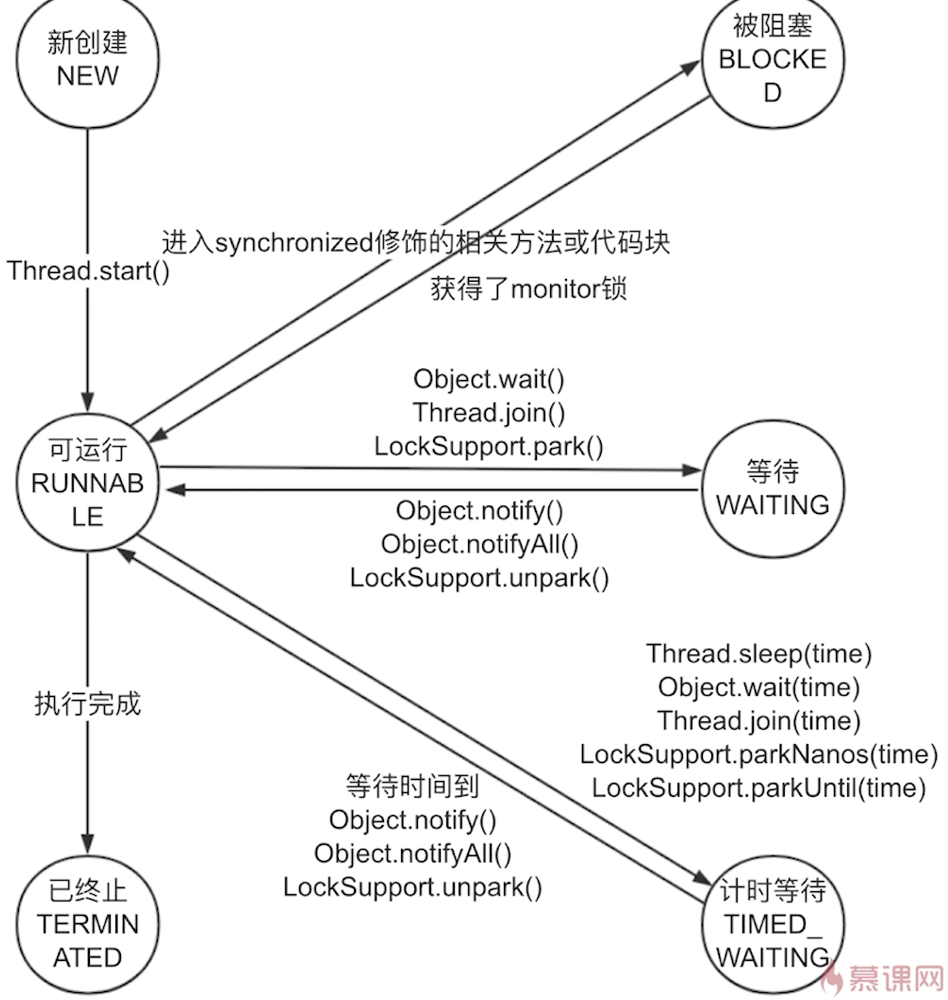
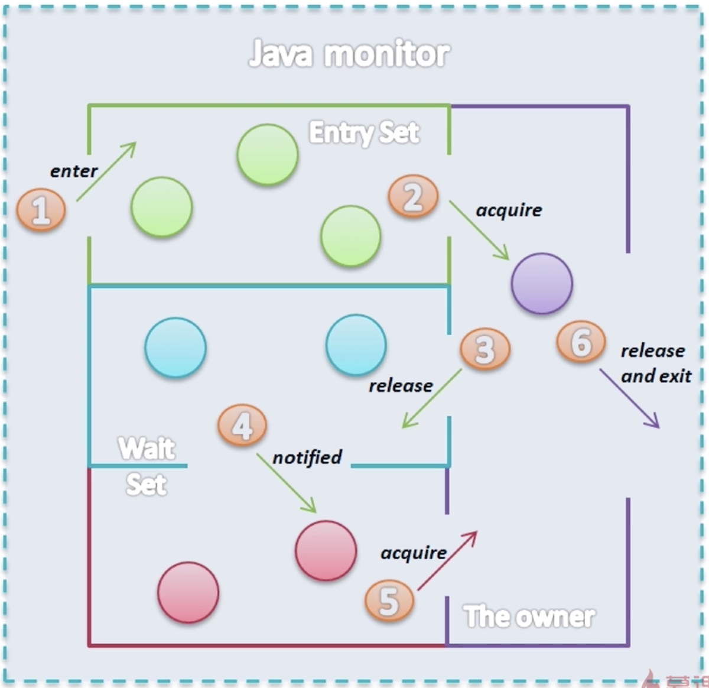

[TOC]

### 1、多线程的2种实现方式
##### 实现Runnable接口(更好)
##### 继承Thread类
#### 实现Runnable相比继承Thread的优点
* 从架构的角度，具体的任务run()不应和创建、运行线程的Thread耦合
* Runnable接口可放入线程池，优化线程使用
* 由于Java只支持单继承，继承Thread限制了扩展性

### 2、如何正确停止线程
* 使用interrupt来通知，而不是强制
* 我们只能通知一个线程去中断，线程何时中断，是否中断都有线程自己决定
* interrupt是一种协作机制，能够使一个线程终止另一个线程
* 这么设计的原因是，线程共享数据，线程结束前需要保存、同步数据，这些让被停止线程去做更合适，直接停止会导致数据不一致等问题

#### 线程自己停止的2种情况
* run()的代码都运行完毕了
* run()中出现异常且未捕获

#### 停止线程的正确方法
* 停止线程的最简单情况(里应外合)
```java
Runnable task = () -> {
    int num = 0;
    while (!Thread.currentThread().isInterrupted() && num < Integer.MAX_VALUE / 2) {
        if (num % 10000 == 0) {
            System.out.println(num + "是1万的倍数");
        }
        num++;
    }
    System.out.println("任务运行结束了!");
};

Thread thread = new Thread(task);
thread.start();
Thread.sleep(500);
thread.interrupt();
```

* 阻塞状态下中断线程
```java
Runnable task = () -> {
    int num = 0;
    while (!Thread.currentThread().isInterrupted() && num < 300) {
        if (num % 100 == 0) {
            System.out.println(num + "是100的倍数");
        }
        num++;
    }
    try {
        Thread.sleep(1000);
    } catch (InterruptedException e) {
        e.printStackTrace();
    }
    System.out.println("任务运行结束了!");
};

Thread thread = new Thread(task);
thread.start();
Thread.sleep(500);
thread.interrupt();
```

* 每次循环都阻塞情况中断线程
```java
Runnable task = () -> {
    int num = 0;
    while (!Thread.currentThread().isInterrupted() && num < 10000) {
        if (num % 100 == 0) {
            System.out.println(num + "是100的倍数");
        }
        num++;
        try {
            Thread.sleep(10);
        } catch (InterruptedException e) {
            Thread.currentThread().interrupt();
            e.printStackTrace();
        }
    }
    System.out.println("任务运行结束了!");
};

Thread thread = new Thread(task);
thread.start();
Thread.sleep(5000);
thread.interrupt();
```

#### 注意当线阻塞状态被中断，抛出InterruptedException后，便会将interrupt标记清除

#### InterruptedException处理
* 优先选择抛出异常，以便异常可以向上传递，而不是try/catch
* 不便抛出异常(例如run()不能抛出异常)时，应该恢复interrupt标记，即在catch中调用中断方法

#### 响应中断方法列表
* Object.wait()
* Thread.sleep()
* Thread.join()
* BlockingQueue.take()/put()
* Lock.lockInterruptibly()
* CountDownLatch.await()
* CyclicBarrier.await()
* Exchanger.exchange()
* InterruptibleChannel相关方法
* Selector相关方法

#### 错误停止线程的方法
* 使用被弃用的stop()、suspend()、resume()
* 使用volatile设置boolean标记位，因为线程阻塞时，无法获取标记位

#### isInterrupted()与interrupted()的区别
* interrupted()是静态方法，作用在当前线程，返回中断状态后会将中断状态置为false
* isInterrupted()不是静态方法，作用在调用它的对象，只返回中断状态

#### 如何处理不响应中断的阻塞
> Socket.io()或者ReentrantLock.lock()等一些阻塞方法无法响应中断，此时需要使用对应可以响应的中断发送方法，例如ReentrantLock.lockInterruptibly()

#### 查看interrupt的c++源码
* 找到[Thread.c](https://github.com/openjdk-mirror/jdk7u-jdk)在Github上的源码(Find file)
* 找到`interrupt0`在Thread类中对应名称`JVM_Interrupt`
* 在`jdk7u-hotspot`库内搜索关键字`JVM_Interrupt`，进入`jvm.cpp`
* Find file找到[thread.cpp](https://github.com/openjdk-mirror/jdk7u-hotspot)里的`Thread::interrupt`方法
* Find file找到[osthread.cpp](https://github.com/openjdk-mirror/jdk7u-hotspot)的`os::interrupt`方法

### 3、线程的6种状态
#### New
> 已创建还未启动(未调用start方法)的状态

#### Runnable(可运行状态)
> 调用了start()后的状态，可能不会立即启动，因为等待CPU资源。对应于操作系统的Ready、Running两种状态。

#### Blocked
> 当一个线程执行到被synchronize修饰的代码块，并且该锁(monitor)已经被其他线程拿走。

#### Waiting
> 

#### Timed Waiting
> 

#### Terminated
> 执行完run()或者出现未捕获的异常



#### 阻塞状态
> 一般而言，Blocked、Waiting、Timed Waiting都叫做阻塞状态

#### 状态图的特殊情况
* 多个线程刚被notifyAll()时，抢不到锁的线程会先进入到Blocked状态
* 发生异常时，可由当前状态(如Waiting)直接进入Terminated状态，而不经过Runnable状态

### 4、Synchronize
#### Synchronize作用
> 保证同一时刻只有一个线程执行该同步代码，以保证多线程安全
> Synchronize内的代码不一定能一次性执行完，中途可能释放锁，例如wait()、notify()

#### Synchronize的两种用法
##### 对象锁
* 同步方法，锁对象为this，当前实例对象
* 同步代码块，锁对象自己指定
##### 类锁
* 静态同步方法，锁对象为当前实例的类的class对象
* 同步代码块，锁对象指定为当前实例的类的class对象

### 5、Thread和Object类的重要线程方法
#### Object的wait()、notify()、notifyAll()
* wait()、notify()、notifyAll()都要在同步代码块中执行，即必须先获得锁然后再使用
* 必须使用同步代码块的锁对象的wait()、notify()
* wait()后会释放锁，即wait()对应对象的锁
* notify()后不会释放锁，直到昨晚同步代码块

##### wait()、notify()、notifyAll()原理


1. 多个线程在EntrySet抢锁
2. 紫色圆圈表示拿到锁
3. 调用wait()后，释放锁，进入WaitSet
4. Waiting状态线程被notify()，在WaitSet变红色，继续抢锁

##### Condition
> wait()、notify()、notifyAll()相对底层，Condition是对其的封装

##### Waiting或Timed Waiting状态被唤醒的情况
* 另一个线程调用wait()的对象的notify()，且刚好被唤醒的是这个Waiting或Timed Waiting状态的线程
* 另一个线程调用这个wait()方法的对象的notifyAll()
* Timed Waiting状态到时
* 线程被中断，触发InterruptedException

##### 生产者消费者模式
##### 交替加1

##### 调用thread.wait()会咋样
> Thread类有点特殊，当线程退出的时候会自动执行notify()，所以设计流程会受影响

##### notifyAll()唤醒所有wait线程后，没有抢到锁的线程会进入什么状态(Blocked)

#### sleep()
> 执行sleep()线程进入阻塞状态(Timed Waiting)，不再占用CPU资源。直到睡醒进入Runnable状态。
* 不释放锁，包括Lock
* 能响应中断，抛出InterruptException异常，并清除中断状态

#### join()
> 等待加入的线程执行完再执行

* 在main线程执行threadA.join()，是threadA线程加入main线程，main线程等待threadA线程执行完，再继续执行main线程
* main线程在等待threadA执行完毕，相当于是main执行了sleep()一样，所以threadA.join()方法的try/catch是捕获main线程的中断异常
* 当main被中断，也就是join()触发中断异常时，应将中断传递给子线程
* join期间线程是waiting状态
* join()的内部就是调用wait()，但为啥没看到调用notify()，实际上线程在run()结束后会自动调用notify()
* join()等价代码
```java
synchronized (thread) {
    thread.wait();
}
```

##### CountDownLatch
##### CyclicBarrier

#### yield()
> 释放CPU时间片，但状态依然是Runnable状态，JVM不一定遵循

### 6、线程属性
名称 | 用途
:---: | ----
id | 标识不同线程，系统分配，从1开始，不能修改 
name | 方便用户、程序员标识不同线程，默认为Thread-id 
isDaemon | true：守护线程，false：用户线程
priority | 告诉线程调度器哪些线程相对多运行

#### 守护线程
> 守护用户线程，为其他线程提供服务，当JVM的用户线程都运行完毕，只剩守护线程时，JVM结束运行。

* 不影响JVM的退出
* 在守护线程创建的线程自动是守护线程，也可人为设置
* 通常守护线程都是由JVM启动

#### 线程优先级
* 有10个优先级，默认是5
* 程序设计不应依赖于优先级，因为不同操作系统效果不一样

### 7、线程安全
> 如果多个线程访问某个对象或方法时，不需要synchronized等额外处理，也能保证程序结果正常，就称为线程安全。

* 线程安全会牺牲性能
* 多个线程访问同一个变量或资源，会有线程安全问题，比如对象属性、静态变量、共享缓存、数据库
* 多个线程进行依赖时序的操作，也会有线程安全问题，例如先读再写，读完线程调度器调度另一个线程写，再调度这个线程写

#### 多线程性能问题
##### 上下文切换
* 上下文切换就是线程调度器切换不同线程
* 当运行的线程数超过CPU的核心数时，就会发生上下文切换
* 通常一次上下文切换消耗5000-10000个CPU时钟周期，大约几微秒
* 缓存开销：CPU会将经常执行的指令缓存起来，切换线程后，缓存指令被清除，
* 应避免这些导致上下文频繁切换的情况：抢锁、IO、频繁线程阻塞

###### 上下文切换过程
* 挂起当前线程
* 把线程当前状态(上下文)保存进内存
* 状态包括当前线程执行到哪一个指令了，程序计数器(寄存器)

##### 内存同步
* 同步代码块或volatile等为保证可见性会在变量修改后刷新主内存，标记其他工作内存失效，在其他线程读取工作内存时再从主内存刷新，这会导致更多的内存同步，影响性能
* 同步代码块或volatile等为防止重排序，会阻止编译器、CPU优化代码

