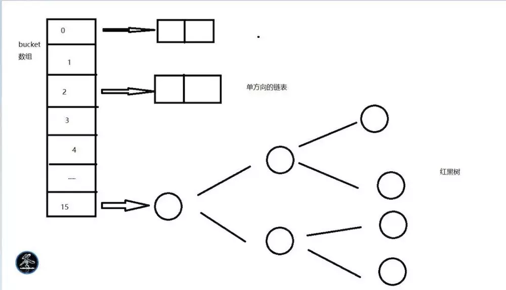

接口 | 是否有序 | 元素是否重复
--- | :---: | :---:
Collection | 否 | 是
List | 是 | 是
HashSet | 否 | 否
TreeSet | 是(二叉树排序,元素需事先Comparable接口) | 否
HashMap | 否 | key不可重复，value可重复
TreeMap | 是(二叉树排序,元素需事先Comparable接口) | key不可重复，value可重复

常用集合 | 结构特点
--- | ---
Stack | 栈结构(后进先出)
HashMap | 基于哈希表的 Map 接口的实现, 使用顺序存储及链式存储的结构

### List
> List中存储的数据是有顺序的，并且值允许重复

常用集合 | 结构特点
:---: | :---: | :---:
ArrayList | 一个自动扩容的数组，线程安全，查找，更改快。在除末尾之外的地方增加/删除元素，由于要移动后面的元素，所以性能会差
LinkedList | 实现List、Queue，可当做队列使用,以双向链表实现。链表无容量限制，但双向链表本身使用了更多空间，也需要额外的链表指针操作。查找慢，最多需要移动元素总个数的一半，增删只需修改前后节点指针，但增删在中间位置一样需要移动指针

### Map
> Map中存储的数据是无序的，它的键是不允许重复的，但是值是允许重复的

常用集合 | 结构特点
:---: | :---: | :---:
HashMap | 基于hash表的Map接口实现，非线程安全，高效，支持null值和null键
LinkedHashMap | LinkedHashMap是HashMap的子类，与HashMap有着同样的存储结构，但它加入了一个双向链表的头结点，将所有put到LinkedHashmap的节点一一串成了一个双向循环链表，因此它保留了节点插入的顺序，可以使节点的输出顺序与输入顺序相同
TreeMap | TreeMap的实现是红黑树算法的实现，支持排序
HashTable | 线程安全，低效，不支持null值和null键
ConcurrentHashMap | 并发版HashMap

### Set
> Set中存储的数据是无顺序的，并且不允许重复

常用集合 | 结构特点
--- | ---
HashSet | 底层是由 Hash Map 实现，不允许集合中有重复的值，使用该方式时需要重写 equals()和 hash Code()方法
LinkedHashSet | 继承于 HashSet，同时又基于 LinkedHashMap 来进行实现，底层使用的是 LinkedHashMap，主要功能用于保证FIFO即有序的集合(先进先出)
TreeSet | 主要功能用于排序，可以指定自然顺序(Comparable)或比较器顺序(Comparator)

* `List`和`Set`是存储**单列数据的集合**，`Map`是存**储键值对这样的双列数据的集合**

### Queue

* 先进先出队列

### Hash(散列)

> 将集合分为多个区域，每个元素都对应一个区域，查找元素时，先确定元素所在的区域，再到这个区域里查找，这样比和集合中的每一个元素比对要快捷的多。

- hashCode方法就是根据一定的规则将与对象相关的信息（比如对象的存储地址，对象的字段等）映射成一个数值，这个数值称作为**散列值**
- hashCode返回的不是对象的存储地址，而是哈希表中的位置
- 哈希数据结构的集合查找、插入速度非常快，但遍历不方便
- 哈希表包含所有的哈希值
- 哈希表中同一个哈希值可能对应多个对象，一样可以减少比较次数(equals())

### HashMap

> HashMap是一种“数组+单向链表/红黑树”数据结构，即数组的每个元素为单向链表/红黑树。在put操作中，通过key的hashCode值找到数组下标，将键值对放入数组中对应的下标位置。若hashCode重复，将会把这个数组元素上的链表进行遍历，将新的数据放到链表末尾。从1.8开始，单链表长度大于8就会转成红黑树数据结构。