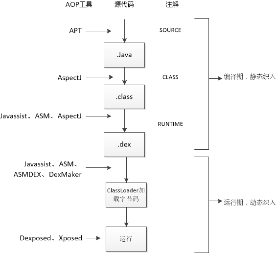

### APT(Annotation Processing Tool)
* 通过注解处理器过滤被注解的类
* `javapoet`：生成java文件
* 代表作：DataBinding、Dagger2、ButterKnife、EventBus

### AspectJ
* AOP(Aspect-Oriented Programming)框架
* 修改java文件，并生成class文件
* 代表作：Hugo

### Javassist&ASM
* 直接修改class文件
* `Javassist`源码级API操作比`ASM`更简单
* `Javassist`使用反射机制，比使用`Classworking`技术的`ASM`要慢得多
* 

