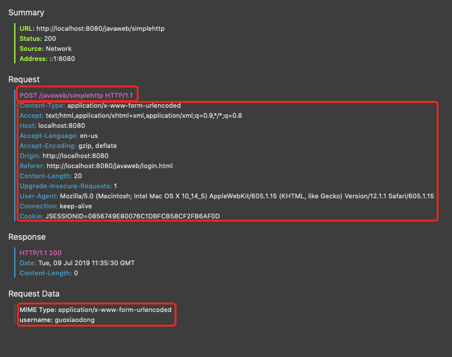

### Servlet
* 全称Server applet(服务端小程序)
* Servlet对象都是通过反射生成的
* Servlet的运行要依赖于Web容器，Tomcat就是Web容器
* `<load-on-startup>`<0时，servlet第一次被访问时才创建，>=0时，服务器启动时创建
* Servlet是单例的，多个用户同时访问时可能存在线程安全问题，加锁太影响性能，尽量不要在Servlet中定义成员变量，即使定义了也不要对其进行修改，保证只读不写。
* destroy()在Servlet销毁前调用，一般用于释放资源
* `GenericServlet`：空实现了除`service()`之外的其他方法，是个抽象类
* `HttpServlet`：支持Http协议， 只需重写`doGet()`、`doPost()`
* `urlPattern`可以是`/xx/xx`形式，也可以是`*.do`或`aa.bb`这种形式

### Http
* Hyper Text Transfer Protocol(超文本传输协议)
* 特点：
	* 基于`TCP/IP`，默认端口号`80`
	* `请求、相应模型`：一次请求对应一次响应
	* `无状态`：每次请求之间相互独立，不能交互数据
* 历史版本
	* `1.0`：每次请求前都要建立连接，响应后都要断开连接
	*  `1.1`：每次请求前复用之前的连接(如果有)、响应后过一会再断开连接
	* 建立连接耗时耗资源
* 请求消息数据格式

	
	1. 请求行
		请求方式 | 请求url | 请求协议/版本
		--- | --- | ---
		GET | /login.html | HTTP/1.1
		* Http有7种请求方式
			* `GET`：请求参数在请求行中，请求url长度有限制，不安全
			* `POST`：请求参数在请求体中，可用来下载文件，url中没有请求参数
		
	2. 请求头：键值对
		名称 | 作用
		--- | ---
		User-Agent | 浏览器版本信息
		Accept | 浏览器支持解析的文件格式
		Accept-Encoding | 浏览器支持的压缩格式
		Connection | keep-alive表示可以复用
		Referer | 告诉服务器，我从哪里来(1.防盗链，2.统计)
	3. 请求空行(分隔作用)
	
	4. Request Data请求体(POST方式才有，放置参数)

