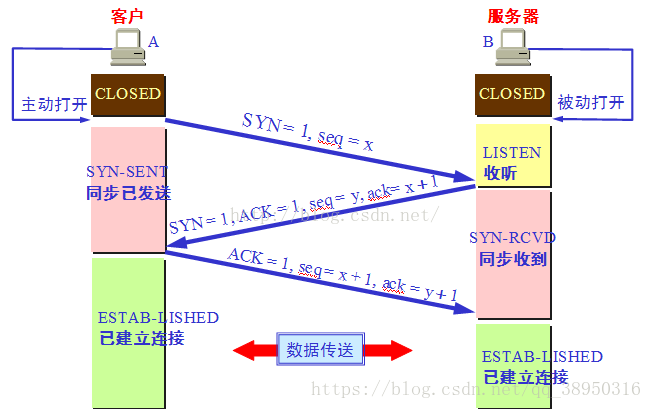
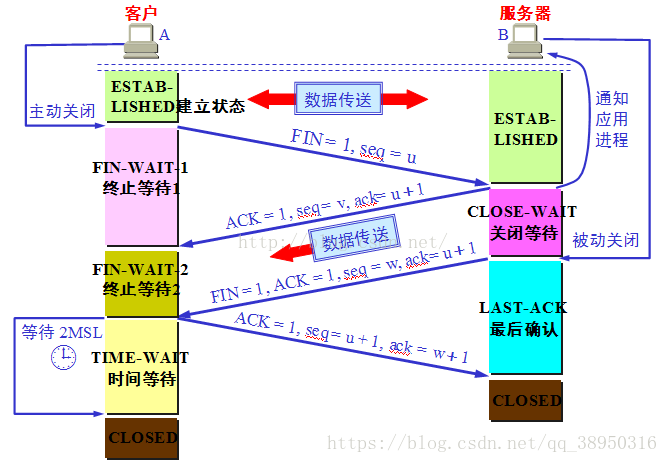

### 网络模型

 

### TCP三次握手

关键字 | 大小 | 含义
--- | ---
序列号seq | 4字节 | 用来标记数据段的顺序，TCP把连接中发送的所有数据字节都编上一个序号，第一个字节的编号由本地随机产生；给字节编上序号后，就给每一个报文段指派一个序号
序列号ack | 4字节 | 
确认标志位ACK | 1位 | 1表示有效，0表示无效
同步标志位SYN | 1位 | 1表示同步连接，0表示已完成
终止标志位FIN | 1位 | 1表示数据发送完毕，0表示

* 第一次握手：建立连接。客户端发送连接请求同步SYN报文，SYN=1，seq=x。
* 第二次握手：服务器接收SYN报文，进行确认，设置ACK=1,表示确认。同时设置自己的SYN=1，设置seq=y,ack=x+1。其中seq为服务器生成的序列号，ack为第一次握手的seq序号加一。
* 第三次握手：客户端接收SYN+ACK报文，设置ACK=1，表示确认收到。同时设置seq=x+1,ack=y+1。其中seq为客户端生成的下一个序列号，ack为第二次握手的seq序号加一。

### 四次挥手

### Http通信过程

### Http
#### http工作流程
* 客户端与服务器建立连接
* 客户端向服务器提出请求
* 服务器接受请求，并根据请求返回响应的数据
* 客户端与服务器断开连接

#### 客户端发送请求到服务器
* 请求行：
* 通用信息头
* 请求头：
* 实体头
* 报文主体

#### 服务端响应客户端
* 状态行：1：xx信息、2：xx成功、3：xx重定向、4：xx客户端错误、5：xx服务器错误 

### Https
#### 第一次https请求
* 客户端向服务端发起请求，请求信息包含客户端支持的加密算法，服务端确认支持此加密算法并返回公钥
* 客户端验证公钥，并生成对称加密密钥使用公钥加密，发送给服务端
* 服务端用私钥解密拿到对称加密密钥，然后用对称加密密钥给数据加密发送给客户端

#### 第二次https请求
* 